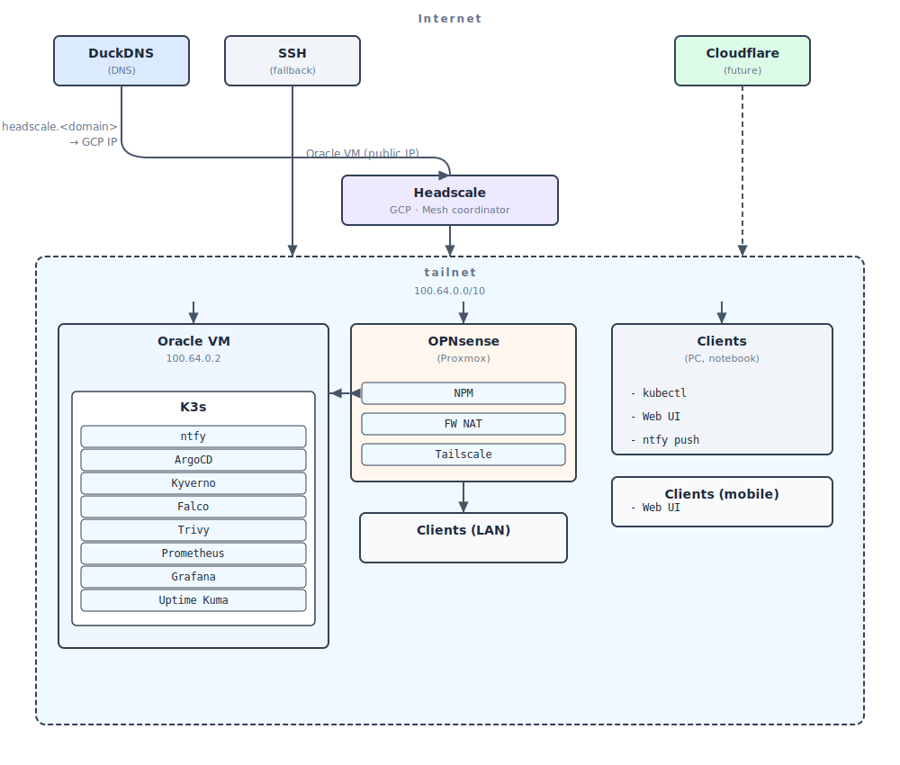
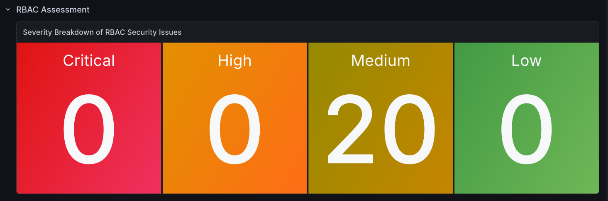
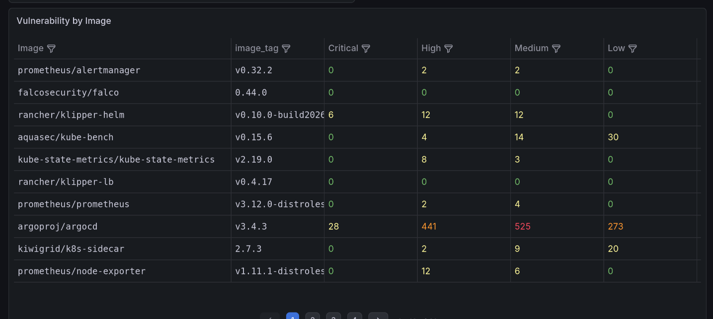

# K3s Cloud Architecture

> This repository is a sanitized mirror of a live K3s node — all manifests, policies, and configurations shown here are actively running. Some applications and internal configurations are omitted to keep the focus on the core infrastructure stack.

Access to all services is restricted to the tailnet mesh (100.64.0.0/10). ACLs on Headscale define which nodes and users can communicate, and OPNsense firewall enforces an additional layer — LAN devices can connect to the cluster, but cluster-initiated connections to the LAN are blocked.

No services are exposed to the public internet.

## Provisioning

- **Infra as Code** — initial VM bootstrap with cloud-init, all software and configuration deployed and managed with Ansible.

## Stack

- **GitOps:** ArgoCD
- **Admission Control:** Kyverno
- **Runtime Security:** Falco
- **Scanning:** Trivy, kube-bench
- **Monitoring:** Prometheus, Grafana, Alertmanager
- **Image Updates:** Diun (+ Renovate planned)

## Design

- **Mesh-only access** — every service is reachable exclusively through the tailnet (100.64.0.0/10). No open ports on the public internet.
- **Defense in depth** — firewall (OPNsense) + admission control (Kyverno) + runtime detection (Falco) + vulnerability scanning (Trivy) + CIS benchmarking (kube-bench).
- **GitOps-driven** — ArgoCD reconciles all manifests declaratively.
- **Real-time alerts** — Prometheus Alertmanager and Diun send push notifications via ntfy for security events, vulnerabilities, and image updates.

## Dashboards

*RBAC security assessment — 0 Critical, 0 High, 20 Medium.*

*Trivy Operator vulnerability reports. ArgoCD v3.4.3 uses a Debian base image (not distroless), which accounts for ~90% of reported CVEs. Distroless-based images (Falco, Prometheus, node-exporter) show 0 Critical vulnerabilities.*
